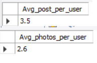

# Instagram Project


1. Your Task: Identify the five oldest users on Instagram from the provided database.

```
select username from users
order by created_at 
limit 5;
```


2. Your Task: Identify users who have never posted a single photo on Instagram.

```
select distinct u.id, u.username from users u
left join photos p
on u.id = p.user_id
where p.image_url is null
```


3. Your Task: Determine the winner of the contest and provide their details to the team. 

```
select p.user_id ,us.username, e.Num_of_likes ,e.photo_id from (select photo_id, count(user_id) as Num_of_likes from likes group by photo_id) e
join photos p
on e.photo_id = p.id
join users us
where us.id = p.user_id
order by Num_of_likes Desc
LIMIT 1
```


4. Your Task: Identify and suggest the top five most commonly used hashtags on the platform
```
select t.tag_name, tg.Count_of_hashtags from (select tag_id, count(photo_id) as Count_of_hashtags from photo_tags group by tag_id) tg
join tags t
on tg.tag_id = t.id
order by tg.Count_of_hashtags desc
limit 5
```


5. Your Task: Determine the day of the week when most users register on Instagram. Provide insights on when to schedule an ad campaign.

```
select Day_of_week, count(username) as Num_of_registration from (select *,DAYNAME(created_at) as Day_of_week from users) new_user
group by Day_of_week
order by Num_of_registration DESC
limit 2
```


6. Your Task: Calculate the average number of posts per user on Instagram. Also, provide the total number of photos on Instagram divided by the total number of users.

```
select round(sum(photo_count)/count(username),1) as Avg_post_per_user from 
(select username, count(photo_id) as photo_count from (select u.id, u.username, p.id as photo_id from users u join photos p on u.id = p.user_id) gro
group by username) final

SELECT ROUND((SELECT COUNT(*) FROM photos) / (SELECT COUNT(*) FROM users), 1) AS Avg_photos_per_user;
```



